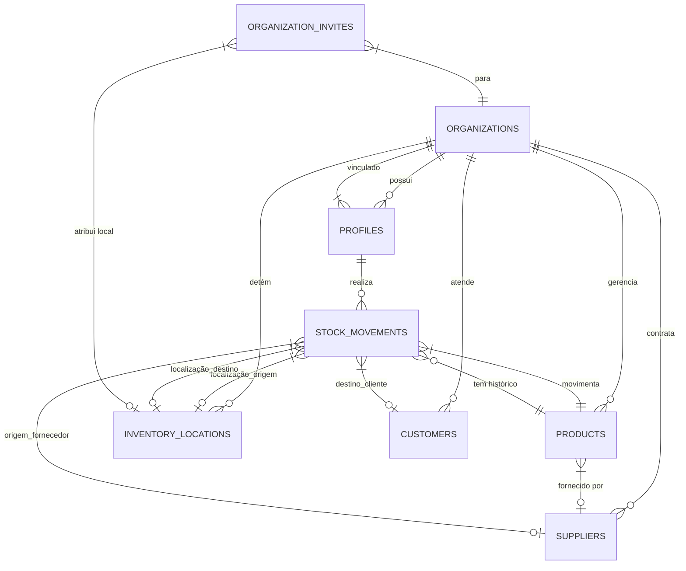

# Nozesfy — Gestão de Estoque

> **Versão:** 1.0.0  
> **Status:** Finalizada


# 

📄 [CHANGELOG.md](./CHANGELOG.md) — Histórico de alterações  
🤖 [AGENTS.md](./AGENTS.md) — Instruções para agentes de IA (OpenCode)

## 1. Visão Geral
O **Nozesfy** é uma plataforma robusta de gestão de estoque e controle, projetada para atender pequenos comércios e empresas. O sistema oferece controle preciso de estoque, gestão de fornecedores, clientes e movimentações financeiras/materiais.

### 1.1 Objetivo
Centralizar e automatizar o controle de estoque, minimizando perdas por vencimento ou falta de estoque, e permitindo uma visão analítica do desempenho organizacional através de métricas em tempo real.

---

## 1.2 Equipe do Projeto
O desenvolvimento e manutenção do Nozesfy são conduzidos pela seguinte equipe técnica:

- **Edigelson**: Frontend & Backend
- **Alaide**: Lider Tecnica e Gestão de Documentação
- **Luciana**: Gestão de Documentação
- **William**: Arquitetura de Banco de Dados & Design
- **Arthur**: Design

---

## 1.3 Contexto Acadêmico
Este projeto foi desenvolvido como parte integrante do currículo acadêmico:

- **Curso**: Técnico em Desenvolvimento de Sistemas
- **Turma**: 2025/2027
- **Instituição**: Senac BA

---

## 2. Estrutura do Projeto
A organização dos arquivos segue o padrão do Next.js 15 (App Router) e as melhores práticas de modularização:

### 2.1 Pastas Principais
- **`app/`**: Rotas e páginas (Next.js App Router).
    - `api/`: Endpoints serverless (webhooks Stripe).
    - `dashboard/`: Área restrita com sidebar e auth guard próprios.
    - `layout.tsx`: Layout raiz com `AuthProvider`.
- **`components/`**: Componentes React reutilizáveis (Navbar, AuthProvider, Footer).
- **`lib/`**: Core da aplicação.
    - `db/`: Schema Drizzle e conexão com SQLite.
    - `actions/`: Server Actions (auth, inventory, stripe).
- **`drizzle/`**: Migrações SQL geradas automaticamente.
- **`public/`**: Arquivos estáticos (logos, ícones).
- **`tkinter/`**: Wrapper desktop em Python (PyWebView).
- **`scratch/`**: Scripts utilitários para DB (não fazem parte do app).
- **`hooks/`**: Hooks React personalizados.

### 2.2 Arquivos de Configuração
- **`sqlite.db`**: Banco de dados SQLite versionado.
- **`drizzle.config.ts`**: Configuração do Drizzle ORM.
- **`next.config.ts`**: Configuração do Next.js 15.
- **`package.json`**: Manifesto com dependências e scripts.
- **`main.spec`**: PyInstaller spec para build do desktop app.
- **`tsconfig.json`**: TypeScript strict mode, path alias `@/*`.

---

## 3. Arquitetura Técnica
A aplicação segue os padrões modernos de desenvolvimento Full Stack:

- **Frontend/Backend**: [Next.js](https://nextjs.org/) (App Router)
- **Linguagem**: TypeScript
- **Banco de Dados**: SQLite (Local/Embeddable)
- **ORM**: [Drizzle ORM](https://orm.drizzle.team/)
- **Estilização**: Tailwind CSS
- **Autenticação**: JWT (JSON Web Tokens) com armazenamento em Cookies HttpOnly e Bcrypt para hashing de senhas.
- **Integração Desktop**: Wrapper em Python (Tkinter) compilado via PyInstaller.
- **Pagamentos**: Stripe API para gestão de assinaturas.

---

## 4. Requisitos Funcionais (RF)

> **Nota:** Os requisitos abaixo foram definidos na fase de planejamento acadêmico. Consulte o código e os testes para o comportamento atual.

O sistema deve permitir:

| ID | Requisito | Descrição |
|:---|:---|:---|
| **RF01** | Autenticação de Usuários | Login, Cadastro e Recuperação de Senha com criptografia. |
| **RF02** | Gestão Multi-tenant | Criação e isolamento de dados por Organização. |
| **RF03** | Controle de Estoque | Cadastro de produtos, categoria e unidades. |
| **RF04** | Movimentações | Registro de Entradas (Entry), Saídas (Exit) e Transferências entre locais. |
| **RF05** | Localizações | Gestão de múltiplos pontos de estoque (Depósitos, Lojas, etc). |
| **RF06** | Gestão de Parceiros | Cadastro de Fornecedores e Clientes associados às movimentações. |
| **RF07** | Dashboard Analítico | Visualização de valor total de estoque, produtos críticos e movimentações recentes. |
| **RF08** | Alertas Automáticos | Notificações de estoque baixo (Ruptura) e produtos próximos ao vencimento. |
| **RF09** | Gestão de Equipe | Convite de membros via e-mail e atribuição de papéis (Owner, Member). |
| **RF10** | Exclusão de Conta | Remoção completa de dados da organização pelo proprietário. |
| **RF11** | Modo Desktop | Alternância e configuração para exibição em interface dedicada via shell Python. |

---

## 5. Requisitos Não Funcionais (RNF)

Atributos de qualidade e restrições técnicas:

| ID | Requisito | Descrição |
|:---|:---|:---|
| **RNF01** | Isolamento de Dados | Nenhuma organização pode acessar dados de outra (Strict Organization ID). |
| **RNF02** | Segurança | Todas as senhas devem ser armazenadas com Salt/Hash (Bcrypt). |
| **RNF03** | Performance | Listagem de histórico de estoque limitada a 200 registros por consulta inicial. |
| **RNF04** | Disponibilidade | O banco SQLite garante persistência local estável e backups simplificados. |
| **RNF05** | Portabilidade | Funciona tanto em navegadores modernos quanto em Windows/macOS/Linux via wrapper. |
| **RNF06** | UX/UI | Interface responsiva e otimizada para produtividade. |

---

## 6. Regras de Negócio (RN)

1.  **Criação de Organização**: Ao se cadastrar, todo usuário torna-se automaticamente o `Owner` de uma nova organização padrão.
2.  **Controle de Acesso**: Apenas usuários com o papel `Owner` podem convidar novos membros, excluir a organização ou resetar dados globais.
3.  **Cálculo de Estoque**: A quantidade total de um produto é a soma das quantidades em todas as localizações associadas.
4.  **Movimentações Negativas**: O sistema deve impedir saídas ou transferências que resultem em saldo negativo no estoque.
5.  **Critério de Alerta de Estoque**: Um produto entra em estado "Crítico" se `quantidade <= quantidade_minima`.
6.  **Critério de Alerta de Vencimento**: Aviso de "Atenção" se `expiry_date` for nos próximos 30 dias; "Crítico" se a data já passou.
7.  **Transferência entre Locais**: Uma transferência deve reduzir o saldo na origem e aumentar no destino em uma única transação atômica.

---

## 7. Modelagem de Dados (MER)

O diagrama abaixo representa a estrutura de tabelas e relacionamentos do banco de dados SQLite gerenciado pelo Drizzle.



---

## 8. Dicionário de Dados

### 7.1 Tabela: `organizations`
Raiz de cada cliente do sistema.
- `id`: Identificador único (UUID).
- `name`: Nome da empresa/organização.
- `subscription_tier`: Plano (basic, pro).
- `stripe_customer_id`: ID para faturamento.

### 7.2 Tabela: `profiles` (Usuários)
- `email`: Identificador de login único.
- `password`: Hash Bcrypt da senha.
- `role`: Papel (owner, member).
- `organization_id`: Chave estrangeira para a organização ativa.

### 7.3 Tabela: `products`
- `barcode`: Código EAN/UPC para leitura rápida.
- `price/cost_price`: Valores de venda e custo (real).
- `quantity`: Saldo total consolidado.
- `stock_by_location`: Objeto JSON mapeando quantidade por local.

### 7.4 Tabela: `stock_movements`
- `type`: Tipo de operação (ENTRY, EXIT, TRANSFER).
- `quantity`: Volume movimentado.
- `new_quantity`: Saldo do produto após a operação.
- `reason`: Motivo (Venda, Compra, Ajuste, Brinde).

---

## 9. Integração Desktop (Shell)
O projeto inclui um componente de interoperabilidade (`tkinter/main.py`) que:
1.  Inicia uma janela nativa via Tkinter.
2.  Carrega o servidor local ou aponta para a URL de produção.
3.  Utiliza o arquivo `main.spec` para gerar o executável (.exe) independente de interpretador Python instalado na máquina do usuário final.

---

## 10. Instruções de Desenvolvimento

### Instalação
```bash
npm install
```

### Configuração do Banco
```bash
npx drizzle-kit push
```

### Execução (desenvolvimento)
```bash
npm run dev
```

### Lint e Typecheck
```bash
npm run lint
npx tsc --noEmit
```

### Migrações (após alterar schema)
```bash
npx drizzle-kit generate
npx drizzle-kit migrate
```

---
